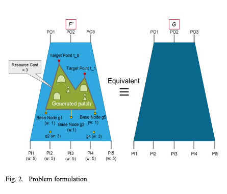
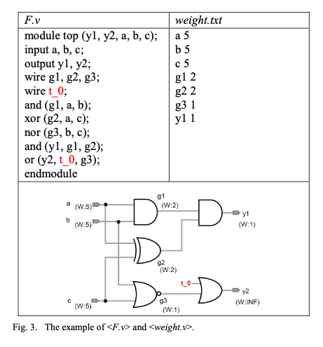
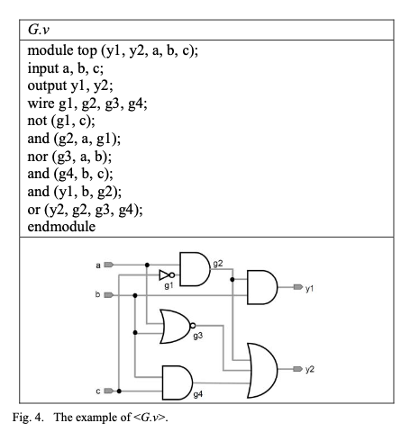
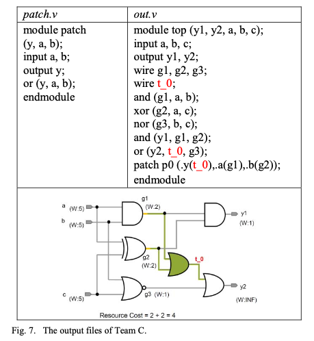
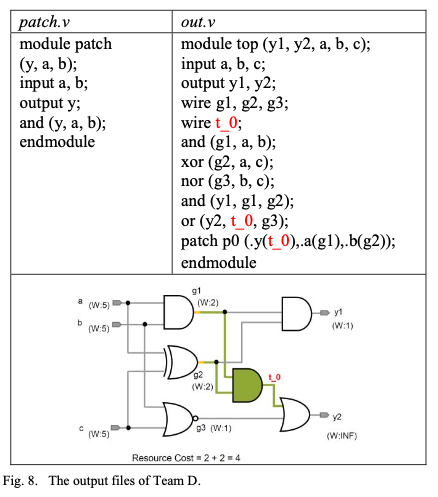

# Resource-aware Patch Generation
## Project Overview
> 1. A project that tries to solve problem A of ICCAD-2017 CAD Contest
> 2. The objective of this contest is to develop a flexible, scalable, and practical resource-aware patch generation algorithm that can be utilized in industry tools.

## Problem Formulation
> 1. Given two circuits **F** and **G**, and the weight information of internal nodes in F, contestants need to utilize internal nodes in F as supports, called base nodes, to generate the patch functions with minimum resource cost at a specific set of target points in F such that F’, the patched circuit, and G are equivalent, as Fig. 2 shows. 
> 

> 2. The resource cost is calculated by the weight summation of the used based nodes.

## Sample Circuits
> 1. **F.v** : Circuit with missing components that are to be decided
> 2. **G.v** : Complete circuit that shows required behavior
> 
F.v             |  G.v
:-------------------------:|:-------------------------:
  |  

## Example Solutions

> **Team C**, as shown in Fig. 7, uses {g1, g2} as the base nodes to generate the patch at t_0. According to the file <weight.txt>, the weights of nodes {g1, g2} are {2, 2}, respectively. Thus, the corresponding resource cost of the patch is 2 + 2 = 4. Besides, the corresponding patch size is 1 because there is only one gate in <patch.v>.

> **Team D**, as shown in Fig. 8, uses {g1, g2} as the base nodes to generate the patch at t_0. Thus, the corresponding resource cost is 4. However, the circuit in <out.v> with patch <patch.v> is not equivalent to the circuit in <G.v>. Thus, it’s an invalid patch and Team D will not get any score for this case.

Team C            |  Team D
:-------------------------:|:-------------------------:
  |  

# How to run
## Use these steps to run the code 
>python ./eco_flow.py <F.v> <G.v> <weight.txt> <patch.v> <out.v>

## Example
> cd ./solution/helper
> mkdir results
> python ./eco_flow.py testcases/unit1/F.v testcases/unit1/G.v testcases/unit1/weight.txt results/patch.v results/out.v

# Requirements

> Code requires ABC binary for functional verification

> Linux: You need to compile ABC (see instruction below)

> Windows: ABC binary already included

# Refrences
>1. [Resource Aware Patch Generation](https://www.google.com/url?sa=t&rct=j&q=&esrc=s&source=web&cd=&ved=2ahUKEwiIteyYzub4AhXLGLcAHb4vAR0QFnoECAMQAQ&url=https%3A%2F%2Fgithub.com%2Fflotisable%2FResourceAwarePatchGeneration&usg=AOvVaw05lTobRtSAxOdYSoQi3Nug)
>2. [Contest Link](http://iccad-contest.org/2017/CAD-contest-at-ICCAD2017/index.html)
>3. [Problem](http://iccad-contest.org/2017/Problem%20A_Ching-Yi.pdf)
